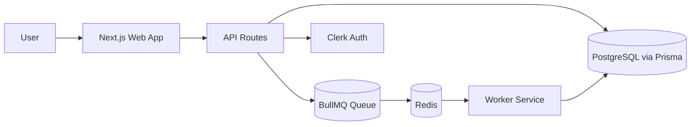
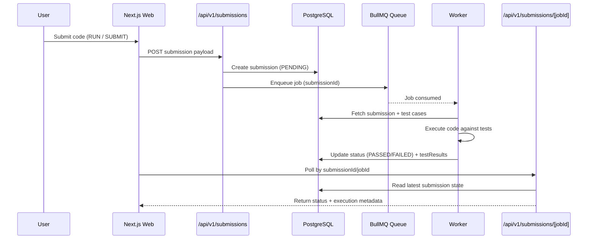
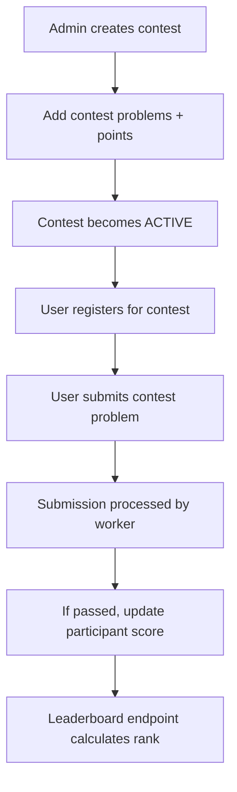

# AlgoArena

Full-stack competitive coding platform with asynchronous code execution, contest workflows, and admin tooling.

Built by **Jatin Singh Rathor**.

## Overview
AlgoArena is designed for algorithm practice and contest-style problem solving. It combines a Next.js frontend, API routes, queue-backed execution pipeline, and Prisma/PostgreSQL persistence.

The platform currently supports code execution for:
- JavaScript
- Python

## Core Features
- Interactive coding UI using Monaco Editor
- Problem list and detailed problem pages with examples/constraints
- Run vs Submit submission modes
- Async submission processing via BullMQ worker queue
- Contest system:
  - contest creation and management
  - participant registration
  - per-contest problem mapping and points
  - leaderboard with rank calculation
- Role-based flows for users and admins
- Clerk-based authentication integration

## Tech Stack
- Frontend: Next.js, React, Tailwind CSS, Monaco Editor
- Backend: Next.js Route Handlers (REST-style API endpoints)
- Auth: Clerk
- Database: PostgreSQL + Prisma ORM
- Queue/Worker: BullMQ + Redis
- Monorepo: Turborepo + pnpm workspaces

## Monorepo Structure
```text
apps/
  web/       # Next.js app (UI + API routes)
  worker/    # BullMQ worker for code execution and result persistence
packages/
  database/  # Prisma schema, migrations, generated client, seed
  queue/     # Shared BullMQ queue config
```

## Architecture


## Submission Lifecycle


## Contest Flow


## Data Model Highlights
Key entities in Prisma schema:
- `User`
- `Problem`, `TestCase`, `Example`, `Constraints`
- `Submission` (status, language, type, result metadata)
- `Contest`, `ContestProblem`, `ContestParticipant`

## API Surface (High-Level)
Representative endpoints in `apps/web/app/api/v1`:
- `POST /submissions`
- `GET /submissions/[jobId]`
- `GET /contests/[id]/leaderboard`
- Contest registration and admin contest/problem management routes

## Engineering Highlights
- Queue-backed async execution avoids blocking request lifecycle
- Worker validates job payload, executes test cases, and persists granular results
- Contest scoring and leaderboard ranking are computed from persisted submission outcomes
- Monorepo setup enables shared queue and database packages across services

## Current Status
- Public source code available
- Not deployed publicly yet

